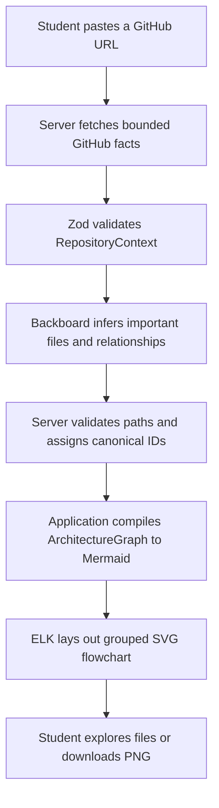
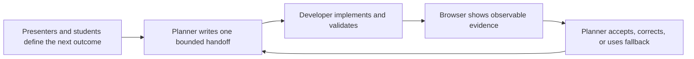

# GitCharts workshop guide

## The project

GitCharts turns a public GitHub repository into an understandable, interactive architecture flowchart. A student pastes a repository URL, Backboard identifies the important files and relationships, and the application renders a grouped diagram. Clicking a file node opens the exact source file on GitHub. The completed diagram can also be explored and downloaded as a PNG.

The project is deliberately familiar and useful. Students do not need to learn a fictional product before they can understand the challenge. They can use the result to explain their hackathon project, onboard a teammate, review an unfamiliar repository, or share a visual build story online.

## What the workshop teaches

The goal is not to watch an AI generate an entire app. Students see a controlled agentic workflow:

1. inspect an existing system;
2. define one checkpoint and its acceptance criteria;
3. let an agent implement that bounded change;
4. validate the machine-generated result with deterministic code;
5. run tests and a production build;
6. inspect the result in a real browser;
7. use evidence to write a narrow correction when needed.

The reusable principle is:

> Code gathers facts. AI interprets architecture. Code validates and renders. Humans review.

## Prepared starter versus live build

The starter is intentionally useful but incomplete.

### Already prepared

- Vite, React, and TypeScript application
- clean GitCharts interface and repository URL form
- server-side GitHub REST collection for public repositories
- repository metadata, default branch, README, bounded file tree, and selected source excerpts
- validated `RepositoryContext` with exact repository paths
- offline fixture for network and rate-limit fallback
- loading, error, warning, and result states
- server-only `GITHUB_TOKEN` support
- Zod, Mermaid, and Mermaid ELK dependencies installed before the webinar
- tests for URL parsing, collection limits, schemas, and server behavior

### Built live

1. Backboard converts `RepositoryContext` into validated `ArchitectureGraph` JSON.
2. Deterministic application code compiles that JSON into a basic Mermaid flowchart.
3. Category subgraphs and ELK produce a grouped, balanced architecture view.
4. Trusted GitHub navigation, zoom, pan, fit, reset, and PNG download make it useful.

Starting from a real repository inspector keeps the 35-minute session focused on meaningful AI and product decisions instead of boilerplate.

## What happens in the background



### Responsibility boundary

| Layer | Responsibility | Must not do |
| --- | --- | --- |
| GitHub collector | Fetch bounded repository facts and exact paths | Guess architecture |
| Backboard model | Identify meaningful files, categories, and relationships | Create trusted IDs, URLs, Mermaid, or browser actions |
| Zod and server code | Validate model output, filter invalid paths, assign IDs, derive links | Trust model output directly |
| Mermaid and ELK | Render deterministic graph syntax and layout | Decide what the architecture means |
| React application | Attach trusted interactions and export the rendered SVG | Navigate to unverified model URLs |
| Human presenters | Set scope, inspect evidence, approve or correct | Assume tests replace browser QA |

## Technology stack

- **React 19 and TypeScript 7:** interface and strongly typed application code
- **Vite 8:** local application, production build, and server-only workshop API middleware
- **Vitest 5:** focused deterministic tests
- **Zod 4:** runtime validation of repository and architecture contracts
- **native `fetch`:** GitHub and Backboard server requests
- **Mermaid 11:** deterministic SVG flowchart rendering
- **`@mermaid-js/layout-elk`:** balanced graph layout
- **plain CSS:** restrained, projector-friendly design
- **Backboard Unified API:** JSON-capable semantic repository analysis
- **Backboard R-CLI:** agentic coding harness used to implement the same prompts during the final rehearsal and webinar

## The data contracts

### `RepositoryContext`

The starter owns this contract. It contains repository identity, default branch, metadata, a bounded tree, README text, selected source excerpts, counts, warnings, and a `github` or `fixture` source marker. It contains facts, not architecture guesses.

Reliability limits are already enforced: at most 2,000 tree entries, 12 excerpts, 6,000 characters per excerpt, and 50,000 excerpt characters in total.

### Model-facing graph

Backboard returns exact paths rather than IDs or links:

```json
{
  "nodes": [
    {
      "path": "src/example.ts",
      "label": "Example service",
      "category": "Backend",
      "description": "Coordinates the example workflow."
    }
  ],
  "edges": [
    {
      "sourcePath": "src/example.ts",
      "targetPath": "src/config.ts",
      "label": "imports"
    }
  ]
}
```

### Final `ArchitectureGraph`

The server verifies every path, sorts nodes, assigns `node-001` style IDs, derives exact GitHub blob links, rewrites valid edges, and assigns `edge-001` style IDs. The browser receives only this canonical structure.

This distinction matters. During rehearsal, model-generated IDs caused a validation failure even though the architectural answer was useful. Moving identity into deterministic code made the system repeatable.

## The four live checkpoints

### Checkpoint 1: semantic graph JSON

Add the Backboard request, model-facing schema, final graph schema, canonicalization, path validation, warnings, server error mapping, and JSON result UI. Stop before Mermaid.

Prompt: [`prompts/01-architecture-json.md`](prompts/01-architecture-json.md)

### Checkpoint 2: first flowchart

Compile the validated graph into escaped, deterministic Mermaid syntax and render an SVG. The AI never writes renderer syntax. Stop before grouping and controls.

Prompt: [`prompts/02-basic-mermaid.md`](prompts/02-basic-mermaid.md)

### Checkpoint 3: grouped layout

Add Frontend, Backend, Database, and Shared subgraphs. Use ELK and bounded layout-only columns so the result stays centered and readable rather than becoming extremely wide or tall.

Prompt: [`prompts/03-grouped-layout.md`](prompts/03-grouped-layout.md)

### Checkpoint 4: interaction and export

Attach trusted GitHub navigation after SVG render. Add keyboard access, viewBox zoom and pan, Fit, Reset, and full-diagram PNG export. Use SVG-native labels from the start so the canvas is not tainted.

Prompt: [`prompts/04-interaction-export.md`](prompts/04-interaction-export.md)

## Suggested 35-minute live session

| Time | Activity | Teaching focus |
| ---: | --- | --- |
| 0:00-0:03 | Show the finished result and state the challenge | Build toward a visible outcome |
| 0:03-0:06 | Inspect the starter and background diagram | Facts, interpretation, validation, rendering |
| 0:06-0:14 | Checkpoint 1 | Structured AI output and trust boundaries |
| 0:14-0:19 | Checkpoint 2 | AI meaning versus deterministic code |
| 0:19-0:25 | Checkpoint 3 | Constraints, layout, and readable visual output |
| 0:25-0:32 | Checkpoint 4 | Trusted interaction and product usefulness |
| 0:32-0:35 | Browser QA, recap, and student challenge | Inspect, test, correct, share |

Agent time is variable. Keep a known-good checkpoint branch, screenshots, and the offline fixture ready. If a turn takes too long, explain the intended diff using the screenshot, switch to the prepared checkpoint, and continue. Reliability is part of the demonstration, not an admission of failure.

## Two-session live workflow

Run two visible agent sessions, just as the project was rehearsed.

### Session A: planner and guide

The planner holds the product context, checkpoint boundaries, acceptance criteria, rehearsal lessons, current state, and fallback decision. It does not edit application code. Give it [`prompts/00-planner-session.md`](prompts/00-planner-session.md).

Its persistent workshop files are:

- [`planner/PLANNER_CONTEXT.md`](planner/PLANNER_CONTEXT.md): stable project truth and decision rules
- [`planner/LIVE_STATE.md`](planner/LIVE_STATE.md): the current checkpoint, evidence, time, and decision
- [`planner/CURRENT_HANDOFF.md`](planner/CURRENT_HANDOFF.md): the one bounded instruction the developer should follow next

### Session B: developer and builder

The developer reads `CURRENT_HANDOFF.md`, loads the checkpoint-builder skill, edits code, runs tests and the build, and reports what browser QA remains. Give it [`prompts/00-developer-session.md`](prompts/00-developer-session.md).

### The visible loop



This makes agentic work understandable. Students see that planning and implementation are different jobs, context can live in versioned files, and a developer agent should not decide its own expanding scope.

During the live session, paste the developer's report and the presenter's browser observations back into the planner. The planner explains what happened, updates the state, and supplies the next exact developer message. Keep both sessions visible when possible.

## Using the repository skills in R-CLI

The repository contains two small teaching skills:

- `$gitcharts-checkpoint-builder` keeps the agent within one checkpoint and requires tests, build, and explicit browser checks.
- `$gitcharts-browser-qa` verifies the observable result and turns failures into narrow, evidence-based correction prompts.

In R-CLI:

1. Start R-CLI in the cloned repository using Accept Edits mode.
2. Run `/skills`.
3. Open the **Repo** tab and load both GitCharts skills.
4. Invoke the skill by name in the checkpoint request.

Example:

```text
$gitcharts-checkpoint-builder Implement workshop/prompts/01-architecture-json.md exactly. Stop before Mermaid.
```

After implementation:

```text
$gitcharts-browser-qa Verify Checkpoint 1. Do not edit files on the first pass.
```

Skills are teaching aids, not magic. The prompt still defines the product boundary and success criteria. The skill supplies a reusable working method.

## Backboard in this project

Backboard lowers the setup cost in two different ways.

First, its API gives the application access to a JSON-capable model through one server integration. Here, that model performs the genuinely semantic job: selecting architecturally important files and describing relationships from a bounded repository context.

Second, R-CLI lets presenters use the same checkpoint prompts as an agentic coding workflow. The agent can inspect the repository, edit files, run tests, and respond to browser evidence. Presenters can change models in R-CLI when useful, but the quality of this workshop should not depend on a specific model producing perfect output on its first attempt.

## Setup before the webinar

```powershell
npm install
Copy-Item .env.example .env.local
npm test
npm run build
npm run dev
```

Add the real values only to `.env.local`:

```text
GITHUB_TOKEN=
BACKBOARD_API_KEY=
BACKBOARD_LLM_PROVIDER=
BACKBOARD_MODEL_NAME=
```

Never commit `.env.local`. The GitHub token is optional for fixture mode but avoids the unauthenticated GitHub rate limit during live collection. The Backboard key is required only from Checkpoint 1 onward.

## Rehearsal lessons worth teaching

- A production build caught an error that focused tests did not.
- Browser QA caught runtime and visual defects that both tests and builds missed.
- Model-generated identifiers were useful text but unsafe application identity.
- The model occasionally invented a nearby path such as `src/tests/...`; validation removed the edge and showed a warning instead of creating a broken link.
- Graph layout needed explicit constraints to avoid extremely wide or tall results.
- HTML labels inside SVG created `foreignObject` elements and tainted canvas export. Root `htmlLabels: false` made PNG export reliable.
- A zoom control can technically work while still being unusable. Browser evidence led to a more generous zoom-out bound.

These are excellent examples of agentic engineering: observe the real system, locate the failing boundary, improve the contract, and verify again.

## Definition of done

The workshop result is accepted when:

- a public GitHub repository or fixture produces a validated `RepositoryContext`;
- Backboard produces a useful graph even when some model paths are filtered with visible warnings;
- the browser receives only canonical IDs and server-derived GitHub links;
- the grouped diagram is readable and stable;
- file nodes open exact GitHub source files by mouse and keyboard;
- zoom, pan, Fit, and Reset work without accidental navigation;
- PNG export downloads the full diagram;
- focused tests, the full suite, and the production build pass;
- a human has completed the browser QA checklist.

## Student extension ideas

After the core workshop, students can add search, a category filter, a selected-node explanation panel, a shareable image caption, cached graph JSON, support for a second diagram type, or a project launch summary. These are extensions, not live-session requirements.
